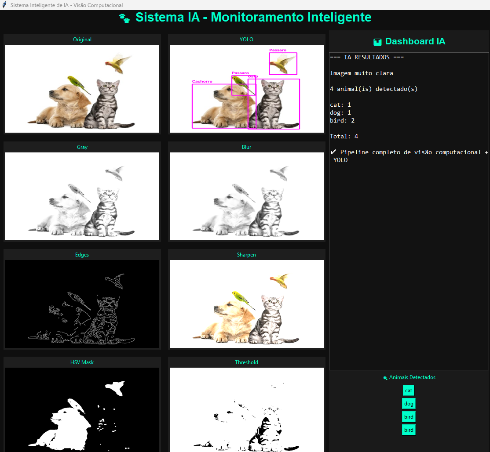
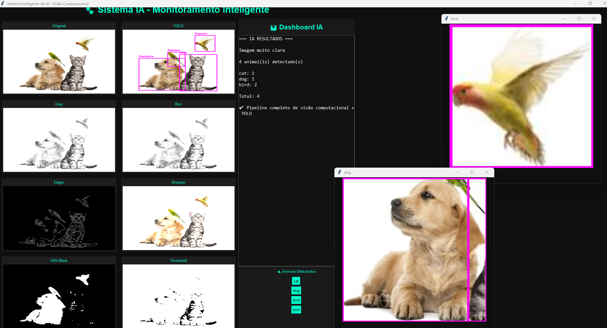

# 🐾 Sistema Inteligente de IA - Monitoramento e Detecção de Animais

Projeto desenvolvido para aplicar conceitos de **processamento de imagens**, **visão computacional** e **inteligência artificial** utilizando Python, com uma interface gráfica interativa para visualização dos resultados.

---

## 🎯 Objetivo

Criar um sistema capaz de:

- Processar imagens (escala de cinza, blur, detecção de bordas, nitidez)
- Analisar cores (conversão para HSV)
- Gerar histogramas de iluminação
- Realizar segmentação e binarização
- Detectar animais em tempo real com IA (YOLO)
- Exibir os resultados em um dashboard interativo

---

## 🛠️ Tecnologias utilizadas

- Python
- OpenCV
- Tkinter (interface gráfica)
- Pillow (PIL)
- Ultralytics YOLO (detecção de objetos)

---

## ⚙️ Funcionalidades

### 🔹 Processamento de imagem
- Conversão para escala de cinza
- Aplicação de blur
- Detecção de bordas
- Nitidez (sharpen)

### 🔹 Análise de cores
- Conversão para HSV
- Máscara HSV

### 🔹 Histograma
- Geração de gráfico de intensidade
- Interpretação automática da iluminação (clara ou escura)

### 🔹 Binarização e segmentação
- Aplicação de threshold
- Segmentação da imagem

### 🔹 Inteligência Artificial
- Detecção de animais com YOLO
- Contagem automática por classe (cat, dog, bird...)
- Recorte individual de cada animal detectado

### 🔹 Dashboard interativo
- Interface construída em Tkinter, exibindo lado a lado a imagem original e todas as etapas de processamento
- Ao clicar no nome de um animal detectado, uma janela separada abre com a imagem recortada correspondente àquele animal

---

## 🖼️ Dashboard interativo em ação



Dashboard exibindo o pipeline completo de processamento de imagem (escala de cinza, blur, detecção de bordas, HSV, threshold) e a detecção de animais via YOLO, com contagem automática por classe.



Interface interativa: ao clicar no nome de um animal detectado, uma janela separada abre com a imagem recortada correspondente àquele animal.

---

## 📊 Pipeline do sistema

1. Aquisição da imagem
2. Geração do histograma
3. Pré-processamento (gray, blur, edges, sharpen)
4. Análise de cores (HSV)
5. Binarização e segmentação
6. Detecção de animais (YOLO)
7. Interpretação automática dos resultados
8. Exibição no dashboard interativo

---

## 🚀 Como executar

1. Clone o repositório:
```
git clone https://github.com/d7ucca/Detec-o-de-animais.git
```

2. Acesse a pasta:
```
cd Detec-o-de-animais
```

3. Crie um ambiente virtual:
```
python -m venv venv
```

4. Ative o ambiente:
```
venv\Scripts\activate
```

5. Instale as dependências:
```
pip install opencv-python pillow ultralytics
```

6. Execute o projeto:
```
python main.py
```

---

## 📌 Observações

- O modelo YOLO é carregado a partir dos arquivos `yolov8n.pt` / `yolov8l.pt` incluídos no repositório
- Certifique-se de que a imagem `animal.jpg` está no caminho correto antes de executar

---

## 👨‍💻 Autor

Projeto desenvolvido para fins acadêmicos / Lucas Barros
